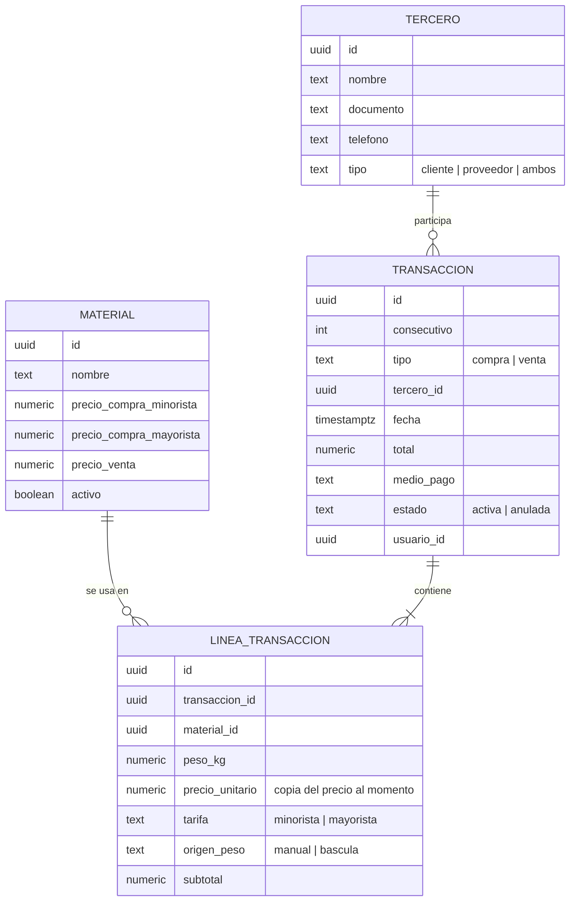
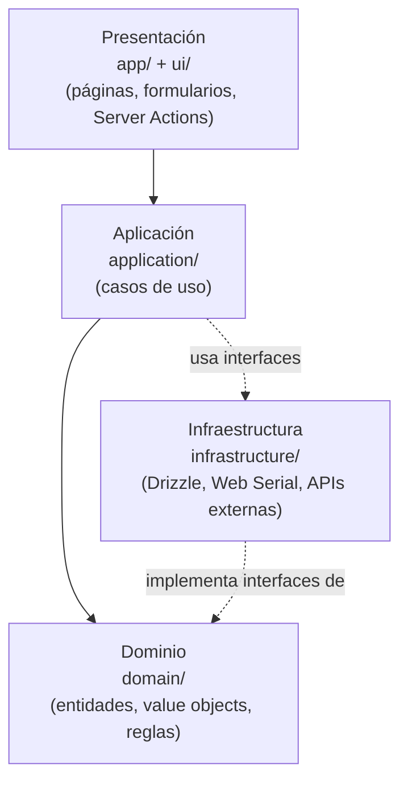

# Arquitectura — Sistema de Gestión para Chatarrería

**Estado:** Stack propuesto; Entregable 1 reformulado como piloto operativo privado (validar alcance comercial antes de comprometer fechas)
**Modo de desarrollo:** Asistido por IA, con revisión humana en cada Pull Request
**Última verificación de precios/planes:** 28/09/2026
**Relacionado con:** [Propuesta_Sistema_Chatarreria.md](Propuesta_Sistema_Chatarreria.md)

---

## 1. Requisitos que condicionan la arquitectura

| #   | Requisito                                                                    | Impacto técnico                                                                           |
| --- | ---------------------------------------------------------------------------- | ----------------------------------------------------------------------------------------- |
| R1  | Entregar valor temprano sin exponer datos ni perder registros                | Liberar un piloto básico cuando operación, acceso y recuperación estén verificados        |
| R2  | Uso elegante desde celular y computador; instalación opcional                | Aplicación web responsive e instalable como PWA; no requiere app de tienda para el piloto |
| R3  | Hosting de bajo costo, compatible con uso comercial y con datos recuperables | Confirmar proveedor, límites, disponibilidad y costo antes de publicar                    |
| R4  | 1–2 usuarios administradores                                                 | Autenticación simple (correo + contraseña)                                                |
| R5  | Inventario exacto y reportes diarios                                         | Base de datos **relacional** (SQL) preferible                                             |
| R6  | Recibo interno imprimible (hoja o tirilla 58/80 mm)                          | CSS de impresión + PDF                                                                    |
| R7  | Lectura de báscula por serial/USB                                            | Web Serial API (Chrome/Edge en PC) o agente local                                         |
| R8  | Exportación a Excel                                                          | Generación de `.xlsx`/CSV                                                                 |
| R9  | Futuro: documento POS electrónico DIAN                                       | Integración vía API con proveedor tecnológico                                             |
| R10 | Los datos del prototipo no se pierden                                        | Modelo de datos definitivo desde el día 1                                                 |
| R11 | **Costo $0 a largo plazo**, aunque la base de ventas crezca                  | Postgres portátil, control de tamaño, archivado y respaldos propios                       |
| R12 | Desarrollo con IA y fines de aprendizaje                                     | Stack moderno, muy documentado y tipado (TypeScript)                                      |
| R13 | Estructura organizacional/empresarial                                        | Monolito modular, ADRs, CI, GitHub Projects, ambientes separados                          |

---

## 2. Opciones de arquitectura (general)

| Opción                                       | Descripción                                                                   | Ventajas                                                                               | Desventajas                                                     | Estado                                                  |
| -------------------------------------------- | ----------------------------------------------------------------------------- | -------------------------------------------------------------------------------------- | --------------------------------------------------------------- | ------------------------------------------------------- |
| **A. SPA + BaaS**                            | React (Vite) + Supabase directo desde el navegador                            | Muy rápido, sin backend propio                                                         | Lógica de negocio en el cliente; dependencia fuerte de Supabase | Descartada                                              |
| **B. Full‑stack Next.js (monolito modular)** | Next.js + TypeScript con frontend y backend en el mismo proyecto + PostgreSQL | Lógica en servidor, un solo repo y despliegue, stack moderno que la IA conoce muy bien | Curva de aprendizaje media                                      | **Elegida**                                             |
| **C. API propia + SPA**                      | React + Node/NestJS + Postgres                                                | Separación total, mucho aprendizaje de backend                                         | Doble despliegue y más código para el piloto actual             | Descartada por ahora (se puede extraer una API después) |
| **D. Monolito clásico**                      | Laravel / Django                                                              | Todo incluido                                                                          | Hosting gratuito limitado; menos alineado con el stack moderno  | Descartada                                              |
| **E. Firebase**                              | React + Firestore                                                             | Rápido                                                                                 | NoSQL: inventario y reportes incómodos                          | Descartada                                              |
| **F. Low‑code**                              | Google Sheets / AppSheet / Excel                                              | Inmediato                                                                              | Sin báscula, recibos ni crecimiento                             | Descartada                                              |

---

## 3. Stack tecnológico elegido

| Capa                     | Tecnología                                                                                            | Por qué                                                                                                   | Descartadas                                                                                            |
| ------------------------ | ----------------------------------------------------------------------------------------------------- | --------------------------------------------------------------------------------------------------------- | ------------------------------------------------------------------------------------------------------ |
| Lenguaje                 | **TypeScript**                                                                                        | Tipado: menos errores y la IA genera código más confiable. Estándar empresarial                           | JavaScript                                                                                             |
| Framework                | **Next.js (App Router)**                                                                              | Frontend + backend (Server Actions / Route Handlers) en un proyecto                                       | React+Vite solo, Vue, Laravel, Django                                                                  |
| UI                       | **Tailwind CSS + shadcn/ui**                                                                          | Componentes profesionales; el código queda en el repo                                                     | DaisyUI, Mantine                                                                                       |
| Formularios y validación | **React Hook Form + Zod**                                                                             | La misma validación en cliente y servidor                                                                 | —                                                                                                      |
| Base de datos            | **PostgreSQL en Neon (plan Free)**                                                                    | SQL real, Postgres estándar (portátil), no se pausa por semanas, pago por uso muy bajo si algún día crece | Supabase (Free se pausa tras 1 semana sin uso y el siguiente plan cuesta US$25/mes), Firestore, SQLite |
| ORM y migraciones        | **Drizzle ORM + Drizzle Kit**                                                                         | SQL tipado, migraciones versionadas en Git, sin atarse a un proveedor                                     | Prisma                                                                                                 |
| Autenticación            | **Better Auth**                                                                                       | Open source, usuarios guardados en nuestra propia BD, sin costo                                           | Supabase Auth, Clerk                                                                                   |
| Hosting                  | **Netlify (Free)** — alternativa: Cloudflare                                                          | Plan gratuito apto para proyectos de clientes (confirmar términos al desplegar)                           | **Vercel Hobby**: sus términos lo limitan a uso personal no comercial                                  |
| Experiencia móvil        | **PWA instalable** en Entregable 1; Capacitor solo si luego se justifica                              | Una sola aplicación web adaptable, acceso desde icono y distribución sencilla                             | App nativa separada desde el inicio: más costo de desarrollo y publicación                             |
| Báscula                  | **Web Serial API** (Chrome/Edge en PC)                                                                | Sin instalar nada                                                                                         | Agente local Node (plan B)                                                                             |
| Recibos                  | **HTML + CSS `@page` + `window.print()`**                                                             | Hoja carta o tirilla 58/80 mm                                                                             | ESC/POS directo (futuro)                                                                               |
| Excel                    | **SheetJS (`xlsx`)**                                                                                  | Exporta desde el navegador                                                                                | —                                                                                                      |
| Pruebas                  | **Vitest** (unitarias) + **Playwright** (end‑to‑end)                                                  | Cálculos e inventario siempre probados                                                                    | —                                                                                                      |
| Calidad                  | **ESLint + Prettier + GitHub Actions (CI)**                                                           | Cada PR se valida automáticamente                                                                         | —                                                                                                      |
| Respaldos                | **GitHub Actions: `pg_dump` diario → almacenamiento externo gratuito** (Cloudflare R2 o Google Drive) | El plan Free de Neon solo guarda 6 h de historial                                                         | —                                                                                                      |

**Principio clave — portabilidad:** todo es PostgreSQL estándar + código propio. Si un proveedor cambia precios, se migra con `pg_dump` / `pg_restore` a otro Postgres sin reescribir la aplicación.

**Ruta móvil:** el Entregable 1 debe ofrecer una interfaz responsive, instalable desde el navegador como PWA en las plataformas compatibles. La PWA conserva la misma cuenta, permisos y base de datos del servicio web. Las operaciones que guardan o consultan registros requieren conexión a internet; no se promete captura ni sincronización offline. Capacitor se evaluará después si el negocio requiere distribución por tiendas o acceso a capacidades nativas que la PWA no cubra; no es parte del Entregable 1.

---

## 4. Modelo de datos inicial (borrador)



**Decisiones del modelo:**

- El inventario se **calcula** a partir de las líneas (compras suman, ventas restan) para evitar descuadres.
- El precio se **copia** en cada línea: si cambia el precio del material, los recibos anteriores no cambian.
- Las transacciones no se borran, se **anulan** (trazabilidad).
- `consecutivo` numera los recibos internos.

---

## 5. Crecimiento de la base de datos y costos

### 5.1 Límites del plan gratuito (Neon Free, verificado 28/09/2026)

| Recurso                  | Límite                                                     | Qué pasa al superarlo                               |
| ------------------------ | ---------------------------------------------------------- | --------------------------------------------------- |
| Almacenamiento           | 0,5 GB por proyecto                                        | Se **bloquean las escrituras** (no se borran datos) |
| Cómputo                  | 100 CU‑horas/mes por proyecto                              | Se suspende hasta el siguiente mes                  |
| Inactividad              | Se "duerme" tras 5 min; despierta en la siguiente consulta | Primera consulta un poco más lenta                  |
| Historial / restauración | 6 horas                                                    | Por eso se hacen respaldos propios                  |

### 5.2 Estimación de crecimiento

Supuesto: ~1 KB por transacción (encabezado + ~3 líneas + índices). Se valida con datos reales tras el primer mes.

| Escenario | Transacciones/día | Crecimiento/año | 0,5 GB alcanza para |
| --------- | ----------------- | --------------- | ------------------- |
| Bajo      | 50                | ~18 MB          | 20+ años            |
| Medio     | 150               | ~55 MB          | ~9 años             |
| Alto      | 400               | ~150 MB         | ~3 años             |

> Los datos de ventas de texto y números ocupan muy poco. Lo que realmente llena una base de datos son **archivos e imágenes**, y esos no se guardan en ella.

### 5.3 Estrategias para mantener costo $0

1. **Nada de archivos en la BD:** los recibos se regeneran desde los datos; si en el futuro hay fotos, van a almacenamiento de objetos.
2. **Tipos e índices justos:** `numeric` con precisión definida, solo los índices necesarios.
3. **Monitoreo:** pantalla de administración con el tamaño actual (`pg_database_size`) y alerta al 70 %.
4. **Tablas de resumen:** `resumen_diario` por material, para reportes rápidos sin recorrer todo el detalle.
5. **Archivado por años:** el detalle antiguo (p. ej. > 3 años) se exporta a archivos comprimidos y se retira de la BD principal; los resúmenes se conservan.
6. **Plan de salida si se necesita más espacio:**
   - Neon Launch (pago por uso, sin mínimo): ~US$0,35 por GB/mes → 2 GB ≈ US$0,70/mes.
   - O Postgres propio en un servidor gratuito (p. ej. Oracle Cloud Always Free), a cambio de administrarlo.

---

## 6. Estructura del proyecto (empresarial)

### 6.1 Arquitectura: monolito modular

Una sola aplicación, dividida en **módulos por dominio del negocio**. Cada módulo tiene capas y no accede directamente a las tablas de otro módulo: se comunican por sus casos de uso. Esto permite separar un módulo en un servicio aparte en el futuro (p. ej. la facturación DIAN).

```
chatarreria/
├── .github/
│   ├── workflows/            # ci.yml, backup.yml
│   ├── ISSUE_TEMPLATE/
│   ├── pull_request_template.md
│   └── copilot-instructions.md   # reglas y convenciones para la IA
├── docs/
│   ├── adr/                  # Architecture Decision Records
│   └── manual-usuario/
├── drizzle/                  # migraciones SQL versionadas
├── src/
│   ├── app/                  # rutas y páginas de Next.js
│   ├── modules/
│   │   ├── materiales/
│   │   ├── terceros/
│   │   ├── compras/
│   │   ├── ventas/
│   │   ├── inventario/
│   │   ├── recibos/
│   │   ├── reportes/
│   │   └── bascula/
│   ├── server/
│   │   ├── db/               # esquema Drizzle y conexión
│   │   └── auth/             # Better Auth
│   └── shared/               # componentes UI y utilidades comunes
└── tests/
    └── e2e/                  # Playwright
```

Capas dentro de cada módulo:

```
compras/
├── domain/          # reglas puras del negocio (cálculo de totales, validaciones)
├── application/     # casos de uso (registrarCompra, anularCompra)
├── infrastructure/  # acceso a base de datos (repositorios Drizzle)
└── ui/              # componentes y formularios
```

### 6.2 Ambientes

| Ambiente   | Base de datos                           | Uso                               |
| ---------- | --------------------------------------- | --------------------------------- |
| Local      | Rama `dev` de Neon                      | Desarrollo diario                 |
| Preview    | Rama temporal de Neon por PR (opcional) | Revisar cambios antes de publicar |
| Producción | Rama `main` de Neon                     | Uso real del cliente              |

Las credenciales van en variables de entorno (`.env.local`, nunca en Git) y en la configuración del hosting.

### 6.3 Flujo de trabajo con IA

1. Crear el **issue** con objetivo y criterios de aceptación.
2. Crear la **rama** del issue.
3. La IA implementa siguiendo `copilot-instructions.md` y los ADR.
4. **Tú revisas** el código, pruebas en local y preguntas lo que no entiendas (aprendizaje).
5. **Pull Request** → CI en verde → merge a `main` → despliegue automático.

---

## 7. Registro de decisiones

Cada decisión importante se documenta también como ADR en `docs/adr/NNNN-titulo.md` (contexto, decisión, consecuencias).

| #   | Decisión             | Opción elegida                      | Motivo                                                               | Estado             | Fecha      |
| --- | -------------------- | ----------------------------------- | -------------------------------------------------------------------- | ------------------ | ---------- |
| D1  | Arquitectura general | Monolito modular Next.js            | Un solo despliegue, lógica en servidor, escalable por módulos        | Propuesta          | 28/09/2026 |
| D2  | Lenguaje             | TypeScript                          | Tipado, mejor código generado por IA                                 | Propuesta          | 28/09/2026 |
| D3  | Base de datos        | PostgreSQL en Neon Free             | $0, portátil, pago por uso mínimo si crece                           | Propuesta          | 28/09/2026 |
| D4  | ORM                  | Drizzle                             | SQL tipado y migraciones versionadas                                 | Propuesta          | 28/09/2026 |
| D5  | Autenticación        | Better Auth                         | Open source, datos en BD propia                                      | Propuesta          | 28/09/2026 |
| D6  | Hosting              | Netlify Free (alt. Cloudflare)      | Gratuito y apto para clientes; Vercel Hobby no permite uso comercial | Propuesta          | 28/09/2026 |
| D7  | Respaldos            | `pg_dump` diario vía GitHub Actions | Neon Free solo guarda 6 h                                            | Propuesta          | 28/09/2026 |
| D8  | Báscula              | Web Serial API + respaldo manual    | Sin instalación; depende del modelo del equipo                       | Pendiente de datos |            |
| D9  | Recibos              | HTML + CSS de impresión             | Simple, sirve para hoja y tirilla                                    | Propuesta          | 28/09/2026 |

---

## 8. Organización en GitHub

### 8.1 Repositorio

- Rama `main` protegida (siempre desplegable).
- Una rama por issue: `feat/12-registro-compras`, `fix/20-total-redondeo`.
- Pull Request por rama, con `Closes #12` para cerrar el issue automáticamente.
- Commits con [Conventional Commits](https://www.conventionalcommits.org/): `feat:`, `fix:`, `docs:`, `chore:`.

### 8.2 GitHub Project (tablero)

**Columnas (Status):** `Backlog` → `Por hacer` → `En progreso` → `En revisión` → `Hecho`

**Campos personalizados:**

| Campo     | Valores                   |
| --------- | ------------------------- |
| Prioridad | Alta / Media / Baja       |
| Tamaño    | S / M / L                 |
| Etapa     | Milestone correspondiente |

### 8.3 Milestones

| Milestone                               | Contenido                                                      | Meta                                        |
| --------------------------------------- | -------------------------------------------------------------- | ------------------------------------------- |
| **M0 — Entregable 1: piloto operativo** | Operación básica publicada y privada, con recuperación probada | Meta inicial: 30 sep 2026; validar esfuerzo |
| **M1 — Mejoras operativas**             | Terceros, exportación, resúmenes y mejoras de uso              | Después de iniciar piloto                   |
| **M2 — Báscula**                        | Lectura de peso por serial                                     | Semana 2–3                                  |
| **M3 — Entrega final**                  | Pruebas, capacitación, documentación                           | Semana 3                                    |
| **Futuro — DIAN**                       | Documento POS electrónico                                      | Por cotizar                                 |

### 8.4 Labels

`feat` · `bug` · `docs` · `infra` · `ui` · `test` · `seguridad` · `bascula` · `recibo` · `inventario` · `decision` · `bloqueado`

### 8.5 Issues iniciales

**M0 — Entregable 1: piloto operativo (estimación por revalidar)**

1. `infra` Preparar aplicación, calidad y migraciones PostgreSQL
2. `feat` Autenticación privada y alta controlada de 1–2 administradores; sin registro público
3. `feat` Catálogo de materiales y precios
4. `feat` Registro de compras/ventas manuales, cálculo en servidor y rechazo de stock insuficiente
5. `inventario` Consulta de stock e historial diario
6. `feat` Anulación trazable de operaciones para corregir errores sin borrar datos
7. `recibo` Recibo interno imprimible en hoja normal
8. `infra` Despliegue HTTPS privado con base persistente, entorno y rollback documentados
9. `seguridad` Respaldo automático y restauración de prueba antes de datos reales
10. `docs` Alta de usuarios por canal seguro y guía breve de operación/soporte
11. `ui` PWA instalable, con icono y experiencia móvil cuidada; operaciones en línea
12. `test` Aceptación del piloto en escritorio y teléfono real

**M1 — Mejoras operativas** `feat` Gestión de clientes/proveedores · `feat` Exportación a Excel · `recibo` Formato tirilla 58/80 mm · `feat` Monitor de tamaño de la base de datos

**Futuro — aplicación de tienda** Evaluar Capacitor si existe una necesidad concreta de publicar en App Store/Google Play o usar capacidades nativas no cubiertas por el navegador.

**M2 — Báscula** 20. `decision` Identificar modelo, salida y protocolo de la báscula 21. `bascula` Prueba de concepto de lectura por Web Serial 22. `bascula` Botón "Tomar peso" en compras y ventas 23. `bascula` Manejo de errores y respaldo manual

**M3 — Entrega final** 24. `test` Pruebas end‑to‑end de los flujos principales 25. `seguridad` Revisión de seguridad (auth, validaciones, variables de entorno) 26. `docs` Manual de uso y capacitación

### 8.6 Plantilla sugerida de issue

```markdown
## Objetivo

Qué debe lograr esta tarea.

## Criterios de aceptación

- [ ] ...
- [ ] ...

## Notas técnicas

Archivos, tablas o decisiones relacionadas.
```

---

## 9. Principios de diseño, patrones y buenas prácticas

> Regla general: aplicar un patrón **solo cuando resuelve un problema real** del proyecto (YAGNI). Un patrón sin necesidad es complejidad extra.

### 9.1 Organización de capas (Clean Architecture simplificada)



**Regla de dependencia:** las flechas apuntan hacia el **dominio**. El dominio no importa nada de Next.js, React, Drizzle ni de ninguna librería externa.

| Capa                | Responsabilidad                                               | Puede importar                        | Ejemplo                                          |
| ------------------- | ------------------------------------------------------------- | ------------------------------------- | ------------------------------------------------ |
| **Dominio**         | Reglas del negocio puras                                      | Nada externo (solo TypeScript)        | `Compra`, `Dinero`, `Peso`, `calcularSubtotal()` |
| **Aplicación**      | Orquestar un caso de uso: validar, llamar al dominio, guardar | Dominio + **interfaces** (puertos)    | `registrarCompra()`, `anularVenta()`             |
| **Infraestructura** | Detalles técnicos: BD, báscula, archivos, APIs                | Dominio + librerías                   | `DrizzleCompraRepository`, `WebSerialBascula`    |
| **Presentación**    | Mostrar datos y recibir acciones del usuario                  | Aplicación (nunca la BD directamente) | Página `/compras/nueva`, `CompraForm`            |

**Flujo de ejemplo — registrar una compra:**

1. `CompraForm` (Presentación) envía los datos a una Server Action.
2. La Server Action valida con **Zod** y llama a `registrarCompra()` (Aplicación).
3. `registrarCompra()` crea la entidad `Compra` (Dominio), que calcula los totales y valida las reglas.
4. `CompraRepository` (interfaz) guarda la compra; `DrizzleCompraRepository` (Infraestructura) la escribe en Postgres dentro de una transacción.
5. Se devuelve el resultado y la UI muestra el recibo.

**Composition root:** un archivo por módulo (`compras/index.ts`) construye las dependencias reales y expone solo los casos de uso. El resto de la app importa únicamente desde ahí.

### 9.2 Principios SOLID aplicados

| Principio                         | Qué significa                                                 | Cómo se aplica aquí                                                                                              |
| --------------------------------- | ------------------------------------------------------------- | ---------------------------------------------------------------------------------------------------------------- |
| **S** — Responsabilidad única     | Una clase/función tiene una sola razón para cambiar           | `calcularSubtotal()` solo calcula; `CompraRepository` solo persiste; el formulario solo muestra                  |
| **O** — Abierto/Cerrado           | Extender sin modificar lo existente                           | Nuevo formato de recibo o nueva marca de báscula = nueva clase, sin tocar las existentes (Strategy)              |
| **L** — Sustitución de Liskov     | Cualquier implementación de una interfaz debe funcionar igual | `BasculaWebSerial`, `BasculaAgenteLocal` y `PesoManual` son intercambiables para el caso de uso                  |
| **I** — Segregación de interfaces | Interfaces pequeñas y específicas                             | `LectorDePeso` solo tiene `leerPeso()`; no una interfaz gigante "Dispositivo"                                    |
| **D** — Inversión de dependencias | Depender de abstracciones, no de implementaciones             | Los casos de uso reciben `CompraRepository` (interfaz), no Drizzle; así se prueban con un repositorio en memoria |

Otros principios: **DRY** (sin lógica duplicada), **KISS** (lo más simple que funcione), **YAGNI** (no construir lo que aún no se necesita), **Separación de responsabilidades**, **Fail fast** (validar en los bordes).

### 9.3 Patrones de diseño GoF que sí aplican

| Patrón                     | Tipo           | Dónde se usa                                                                                                            | Problema que resuelve                              |
| -------------------------- | -------------- | ----------------------------------------------------------------------------------------------------------------------- | -------------------------------------------------- |
| **Strategy**               | Comportamiento | Tarifas (minorista / mayorista), formatos de recibo (carta / 58 mm / 80 mm), parser de cada marca de báscula            | Cambiar un algoritmo sin `if/else` gigantes        |
| **Adapter**                | Estructural    | Báscula (Web Serial, agente local, manual) bajo `LectorDePeso`; a futuro, el proveedor DIAN bajo `ProveedorFacturacion` | Adaptar APIs externas a una interfaz propia        |
| **Factory Method**         | Creacional     | `crearParserBascula(modelo)` y creación de entidades válidas (`Compra.crear(...)`)                                      | Centralizar la creación y sus validaciones         |
| **Facade**                 | Estructural    | `index.ts` de cada módulo expone solo los casos de uso                                                                  | Ocultar la complejidad interna del módulo          |
| **Observer**               | Comportamiento | Lecturas continuas de la báscula hacia la UI; eventos de dominio (`CompraRegistrada` → actualizar `resumen_diario`)     | Reaccionar a cambios sin acoplar emisor y receptor |
| **Singleton** (del módulo) | Creacional     | Conexión a la base de datos (una sola instancia por proceso)                                                            | Evitar abrir conexiones de más                     |

**Ejemplo — Strategy + Adapter en la báscula:**

```ts
// domain
export interface LectorDePeso {
  leerPeso(): Promise<Peso>;
}

// infrastructure
export class BasculaWebSerial implements LectorDePeso {
  /* lee el puerto */
}
export class PesoManual implements LectorDePeso {
  /* toma el valor escrito */
}

// cada marca envía una trama distinta → una estrategia por marca
export interface ParserTrama {
  parsear(trama: string): Peso;
}
```

**Patrones que NO usaremos por ahora (y por qué):** Abstract Factory, Builder, Visitor, Mediator y Command, porque el problema aún no los necesita. Se reevaluará si aparecen varias familias de objetos o flujos complejos.

### 9.4 Patrones de arquitectura (no GoF) que se usan

| Patrón                            | Uso                                                                                             |
| --------------------------------- | ----------------------------------------------------------------------------------------------- |
| **Repository**                    | Acceso a datos detrás de una interfaz (`CompraRepository`)                                      |
| **Unit of Work / Transacción**    | Guardar la compra y sus líneas de forma atómica (todo o nada)                                   |
| **Dependency Injection** (manual) | El composition root entrega las dependencias a los casos de uso                                 |
| **Value Object**                  | `Dinero`, `Peso`, `Consecutivo`: inmutables y con sus propias validaciones                      |
| **DTO + validación de esquemas**  | Datos de entrada validados con Zod antes de entrar a la aplicación                              |
| **Result**                        | Los casos de uso devuelven `{ ok: true, data }` o `{ ok: false, error }` para errores esperados |

**Regla crítica — dinero y peso:** nunca usar `number` de punto flotante para dinero.

- Dinero en COP: entero (pesos) en la aplicación, `numeric(14,2)` en la BD.
- Peso: `numeric(10,3)` (kg con 3 decimales = gramos).

### 9.5 Código limpio y buenas prácticas en TypeScript

**Nombres**

- Lenguaje del negocio en español: `Compra`, `Material`, `registrarCompra`.
- Sufijos técnicos consistentes: `...Repository`, `...Schema`, `...Form`.
- Booleanos con prefijo: `estaActivo`, `tieneStock`.
- Sin abreviaturas crípticas ni números mágicos: `const IVA = 0.19`, no `* 0.19` suelto.

**Funciones**

- Pequeñas y con una sola tarea; máximo ~3 parámetros (si hay más, un objeto).
- **Early return** en lugar de `if` anidados.
- Sin efectos secundarios ocultos; las funciones de dominio son puras.

**Colecciones (equivalente a las _list comprehensions_ de Python)**

```ts
// ✗ Evitar: bucle que muta
let total = 0;
for (const linea of lineas) {
  total += linea.subtotal;
}

// ✓ Preferir: declarativo e inmutable
const total = lineas.reduce((acc, l) => acc + l.subtotal, 0);
const materialesActivos = materiales.filter((m) => m.activo).map((m) => m.nombre);
```

- `const` por defecto; `let` solo si es necesario; nunca `var`.
- No mutar arrays/objetos recibidos: usar spread (`[...lista, nuevo]`).

**Asincronía (async/await)**

```ts
// ✓ Consultas independientes en paralelo
const [inventario, resumen] = await Promise.all([obtenerInventario(), obtenerResumenDiario(fecha)]);
```

- Siempre `await` a las promesas (regla ESLint `no-floating-promises`).
- `try/catch` solo en los bordes (Server Actions), no en cada función.
- No mezclar `.then()` con `async/await`.

**Tipado**

- `tsconfig` con `"strict": true`.
- Prohibido `any`; usar `unknown` + validación con Zod en los bordes.
- Tipos derivados de los esquemas: `type CompraInput = z.infer<typeof compraSchema>`.

**Errores**

- Errores de dominio con clases propias: `StockInsuficienteError`, `PesoInvalidoError`.
- Mensajes claros para el usuario; detalles técnicos solo en logs.

**Comentarios**

- Explicar el **por qué**, no el qué. Si el código necesita un comentario para entenderse, se renombra o se divide.

**Seguridad (OWASP)**

- Validar toda entrada en el servidor (Zod), aunque ya se valide en el cliente.
- Verificar la sesión en cada Server Action.
- Consultas solo mediante el ORM (sin SQL concatenado).
- Secretos solo en variables de entorno.

**Pruebas**

- Dominio: pruebas unitarias con el patrón **AAA** (Arrange, Act, Assert).
- Casos de uso: con repositorios en memoria (gracias a la inversión de dependencias).
- Flujos críticos (compra, venta, recibo): end‑to‑end con Playwright.

### 9.6 Checklist de revisión de cada Pull Request

- [ ] ¿Respeta la regla de dependencia entre capas?
- [ ] ¿La UI no accede directamente a la base de datos?
- [ ] ¿Las entradas se validan con Zod en el servidor?
- [ ] ¿Sin `any`, sin promesas sin `await`, sin números mágicos?
- [ ] ¿El dinero y el peso usan los tipos correctos?
- [ ] ¿Se añadieron o actualizaron pruebas?
- [ ] ¿Entiendo todo el código generado por la IA? (si no, preguntar antes de aprobar)
- [ ] ¿El CI está en verde?
